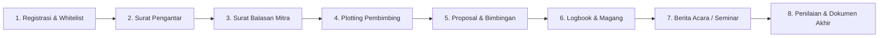

# PROJECT CONTEXT & SYSTEM AUDIT (SI-KP UTM)
> **Aplikasi:** SI-KP Sivitas Sakera &mdash; Teknik Informatika UTM  
> **Status:** Active Development | **Update Terakhir:** 19 September 2026

---

## ⚡ QUICK RULES & SOP
1. **Baca Sebelum Ubah:** Cek [Environment](#1-environment-terkini) & [Audit Keamanan](#5-ringkasan-audit-kode-keamanan--performa).
2. **Frontend UI:** Wajib ikuti [`SIVITAS_DESIGN_GUIDELINES.md`](./SIVITAS_DESIGN_GUIDELINES.md) (Warna `#00288e`, radius `rounded-lg`/`rounded-xl`, anti-slop).
3. **Catat Perubahan:** Tambahkan log ringkas di [Changelog](#7-session-changelog) setiap selesai sesi.

---

## 1. ENVIRONMENT TERKINI

| Item | Konfigurasi | Status / Tindakan |
|---|---|---|
| **OS** | Windows 11 x64 (PowerShell) | Aktif |
| **Suite** | Laragon (`E:\laragon\`) | Apache, MySQL, Mailpit |
| **PHP** | PHP 8.5.10 (vs17-x86 ZTS) | `E:\laragon\bin\php\php-8.5.10-Win32-vs17-x86\php.exe` |
| **System PATH** | `E:\laragon\bin\php\php-8.5.10-Win32-vs17-x86` | Restart terminal jika masih baca 8.3 |
| **Tuning php.ini** | `upload_max_filesize=1024M`, `post_max_size=1024M` | Fix overflow 2G di PHP 32-bit |
| **Ext Wajib** | `pdo_mysql`, `zip`, `dom`, `gd`, `intl`, `mbstring` | `ext-zip` aktif untuk OpenSpout |
| **Database** | MySQL 8.0 (Port 3306) | DB: `kp_prodi` |
| **Node.js / Bundler** | Node.js 20+ / Vite 6 | Aktif |

---

## 2. TECH STACK

- **Backend:** Laravel 13.23.0 | Breeze (Session Auth) | Socialite (Google Login) | Sanctum | OpenSpout 5.11 | Ziggy 2.0
- **Frontend:** React 19 | TypeScript 5.8 | Inertia.js 2.0 | Tailwind CSS v4 (`@tailwindcss/vite`) | Lucide Icons | Motion | PDF.js

---

## 3. ALUR KERJA PRAKTIK & MATRIKS PERAN

### Matriks Tanggung Jawab Peran

| Fitur / Tahapan | Mahasiswa | Dosen | TU | Prodi | Instansi |
|---|:---:|:---:|:---:|:---:|:---:|
| **Akun & Master NIM** | Daftar / Login | - | Validasi & Import | - | - |
| **Surat Pengantar** | Ajukan | - | Verifikasi & Cetak | - | - |
| **Surat Balasan** | Upload Berkas | - | Verifikasi Mitra | - | - |
| **Plotting Dosen & PL** | - | - | - | Kelola & Tetapkan | - |
| **Proposal KP** | Draft & Revisi | Review & ACC | - | Monitoring | - |
| **Logbook Harian** | Input Kegiatan | Validasi | - | - | Verifikasi Lapangan |
| **Berita Acara** | Ajukan Jadwal | Uji / ACC | - | Validasi & Jadwal | - |
| **Penilaian KP** | Lihat Nilai | Input Nilai (60%) | Arsip | Rekapitulasi | Input Nilai (40%) |
| **Laporan Akhir** | Upload Final | ACC Laporan | Verifikasi Berkas | Validasi Yudisium | Terbitkan Sertifikat |

---

## 4. DATABASE & RELASI INTI

| Tabel | Model | Fungsi | Relasi Kunci |
|---|---|---|---|
| `users` | `User` | User multi-role & autentikasi | `belongsTo(ProgramStudi)`, `hasMany(Pendaftaran)` |
| `master_mahasiswas`| `MasterMahasiswa` | Whitelist NIM resmi prodi TI | `belongsTo(User as dosenWali)` |
| `permohonan_akuns` | `PermohonanAkun` | Antrean verifikasi akun baru | Diperiksa oleh TU |
| `pendaftarans` | `Pendaftaran` | **Entitas Induk** siklus KP | Relasi ke Proposal, Logbook, Nilai, Surat |
| `surat_pengantars` | `SuratPengantar` | Pengajuan surat pengantar mitra | `belongsTo(Pendaftaran)` |
| `surat_balasans` | `SuratBalasan` | Bukti penerimaan/penolakan mitra | `belongsTo(Pendaftaran)` |
| `proposals` | `Proposal` | File, versi revisi, dan status | `hasMany(ProposalFeedback)` |
| `logbooks` | `Logbook` | Presensi & catatan kerja harian | Verifikasi ganda: Dosen & Instansi |
| `berita_acaras` | `BeritaAcara` | Pengajuan ujian & seminar KP | `belongsTo(Pendaftaran)` |
| `nilais` | `Nilai` | Komponen nilai terpisah | `belongsTo(User as penilai)` |
| `nilai_akhirs` | `NilaiAkhir` | Nilai akhir (Instansi 40% + Dosen 60%) | `belongsTo(Pendaftaran)` |
| `dokumen_akhirs` | `DokumenAkhir` | Laporan final & sertifikat | `belongsTo(Pendaftaran)` |

---

## 5. RINGKASAN AUDIT KODE (KEAMANAN & PERFORMA)

| Area | Temuan / Risiko | Tingkat | Tindakan Diperlukan |
|---|---|:---:|---|
| **Otorisasi (IDOR)** | Cetak surat & nilai belum sepenuhnya divalidasi kepemilikan user (`pendaftaran->mahasiswa_id == auth()->id()`). | 🔴 Tinggi | Terapkan Laravel Policy di route cetak/download. |
| **Destructive Action** | Endpoint `DELETE /tu/master-mahasiswa-truncate` bisa dipicu tanpa konfirmasi ulang password. | 🔴 Tinggi | Tambahkan prompt password TU sebelum truncate. |
| **File Storage** | Upload proposal & berkas akhir perlu validasi MIME ketat & nama file teracak. | 🟡 Sedang | Validasi `mimes:pdf`, generate hash name, simpan di disk privat. |
| **Query N+1 / Cache** | `HandleInertiaRequests.php` load notifikasi 2x (`load('notifikasis')` + query limit 5). | 🟡 Sedang | Hapus pemanggilan `load()` redundan; gunakan query limit 5 saja. |
| **Database Indexing** | Kolom `status` pada `pendaftarans` & `proposals` sering difilter tapi belum terindeks. | 🟡 Sedang | Buat migrasi index: `(mahasiswa_id, status)`. |
| **Memory Leak (RAM)** | `User::pluck('nim')` memuat seluruh array NIM ke RAM di `TUMasterMahasiswaController`. | 🟢 Rendah | Ganti dengan `whereExists` query. |
| **Code Cleanup** | File artefak sisa dev di root: `test_routes.php`, `refactor.py`, `temp_php84/`. | 🟢 Rendah | Hapus / pindahkan ke folder arsip. |

---

## 6. ROADMAP PENGEMBANGAN

### Fase 1: Keamanan & Stabilitas Query (Prioritas Utama)
- [ ] Buat Policy otorisasi berkas download & cetak (Anti-IDOR).
- [ ] Tambah modal konfirmasi password pada truncate master data.
- [ ] Optimasi query notifikasi di `HandleInertiaRequests.php`.
- [ ] Hapus artefak temporary di root direktori.

### Fase 2: Fitur & Otomasi
- [ ] Export rekap nilai seluruh angkatan ke Excel (OpenSpout).
- [ ] QR Code verifikasi pada lembar cetak Surat Pengantar & Berita Acara.
- [ ] Notifikasi email otomatis untuk status revisi proposal & approval surat.

### Fase 3: Responsivitas & UX
- [ ] Card view mobile untuk tabel data pendaftaran & logbook.
- [ ] Simpan state filter angkatan & pencarian di query URL.

---

## 7. SESSION CHANGELOG

### [SESI 1] - 2026-09-19 - Migrasi PHP 8.5 & Setup Master Context
- **Kendala:** `php artisan serve` gagal karena `openspout/openspout ^5.11` butuh PHP >= 8.4 (lokal masih PHP 8.3.28).
- **Aksi:**
  1. Pasang runtime **PHP 8.5.10** (`php-8.5.10-Win32-vs17-x86`) di Laragon.
  2. Perbaiki `php.ini` (`upload_max_filesize` & `post_max_size` = `1024M`).
  3. Sinkronkan Windows System PATH ke PHP 8.5.10.
  4. Pulihkan [composer.json](./composer.json) ke `"openspout/openspout": "^5.11"`.
  5. Verifikasi: `php artisan about` berjalan normal (Laravel 13.23.0 aktif).
  6. Buat file context memory & audit [`PROJECT_CONTEXT.md`](./PROJECT_CONTEXT.md) dengan standar UX writing ringkas.
- **Status:** Selesai | Server siap dijalankan.

### [SESI 2] - 2026-09-19 - Standardisasi UX Writing & SIVITAS Design Guidelines Frontend (Semua Modul)
- **Tujuan:** Menerapkan pedoman desain SIVITAS ([SIVITAS_DESIGN_GUIDELINES.md](./SIVITAS_DESIGN_GUIDELINES.md)) dan UX Writing ringkas, aksi-sentris, dan formal di seluruh modul antarmuka web (Mahasiswa, Dosen, TU, Prodi, Instansi, Profile).
- **Aksi & Perubahan:**
  1. **Aturan Geometri & Radius Token:**
     - Menghapus semua penggunaan `rounded-full` pada kartu kontainer, tombol aksi, dan badge status.
     - Standar Token: Kartu kontainer (`rounded-xl`), Tombol aksi & Input form (`rounded-lg`), Badge status & Chips (`rounded-md text-xs font-semibold px-2.5 py-1` disertai mini dot/icon), Avatar profil (`rounded-md` atau `rounded-xl`).
  2. **UX Writing & Eliminasi 'Over-Penjelasan':**
     - Menghapus paragraf ceramah/teori berbelit-belit (misal teks panjang di `TU/Dashboard`, `Prodi/Dashboard`, `Prodi/SupervisorPlotting`).
     - Mengganti dengan microcopy lugas, informatif, dan terstruktur serta menambahkan pintasan menu "Aksi Cepat Layanan" pada Dashboard TU dan "Prioritas Penugasan" pada Dashboard Prodi.
     - Memperbaiki peringatan kasar (`* nb : ...`) menjadi komponen alert formal berikon (`AlertCircle`).
  3. **Perbaikan Grid & Konsistensi Tabel:**
     - Memperbaiki `colSpan` pada empty state tabel (misal `colSpan={6}` di `TU/DaftarMahasiswa` dan `colSpan={5}` di `Prodi/Students`).
     - Menambahkan ikon kontekstual Lucide pada setiap CTA button dan badge status.
  4. **Cakupan File yang Direfaktor:**
     - **Mahasiswa:** `Dashboard`, `Pendaftaran`, `Proposal`, `SuratPengantar`, `SuratBalasan`, `Logbook`, `StatusPengajuan`, `BeritaAcara`, `DokumenAkhir/Index`, `Penilaian/Index`, `Logbook/Create`, `Logbook/Edit`.
     - **Dosen:** `Dashboard`, `ReviewProposal`, `Proposal/Review`, `Logbook`, `Logbook/Review`, `Penilaian/Index`, `Penilaian/Create`.
     - **TU:** `Dashboard`, `DaftarMahasiswa`, `GenerateSurat`, `SuratBalasan/Index`, `SuratBalasan/Show`, `VerifikasiPendaftaran/Index`.
     - **Prodi:** `Dashboard`, `SupervisorPlotting`, `Students`, `StudentVerification`, `BeritaAcara/Index`.
     - **Instansi:** `Dashboard`, `Evaluation`, `Pendaftaran`.
     - **Profile:** `Profile/Edit`.
- **Status:** Selesai | Seluruh halaman frontend terstandarisasi.

### [SESI 3] - 2026-09-20 - Responsivitas Mobile Header (Icon-Only), Grid 2-Kolom/Baris & UX Writing
- **Tujuan:** Menghapus logo SI, membuat lebar header sepenuhnya fluid/responsif dengan tombol icon-only di layar sempit (<sm) untuk mengeliminasi horizontal scrollbar, merestrukturisasi 5 kartu peran menjadi grid 2-kolom/baris ringkas agar tidak perlu scroll vertikal panjang, serta memadatkan UX writing.
- **Aksi & Perubahan:**
  1. **Header Fluid & Tombol Icon-Only:**
     - Menghapus `shrink-0` statis pada brand link dan menambahkan `min-w-0 flex-1 truncate` agar teks prodi lentur menyesuaikan lebar layar.
     - Tombol navigasi kanan ("Panduan" & "Sivitas Sakera") otomatis menjadi **Icon-Only** pada layar sempit/mobile (`<sm`), sehingga menghemat ruang horizontal (~70px total) dan menghilangkan horizontal scrollbar secara total.
     - Mengubah root wrapper dengan `w-full overflow-x-hidden`.
  2. **Layout Kartu 2-Kolom / Baris (Non-Scroll):**
     - Mengganti layout kartu 1-kolom yang memanjang vertikal menjadi grid 2-kolom di mobile (`grid-cols-2`) dan 2-baris di desktop (`md:grid-cols-6`):
       - Baris 1: Mahasiswa (`col-span-1 md:col-span-2`) | Dosen Pembimbing (`col-span-1 md:col-span-2`) | Koordinator KP (`md:col-span-2`)
       - Baris 2: Tata Usaha (`col-span-1 md:col-start-2 md:col-span-2`) | Pembimbing Lapangan (`col-span-2 md:col-span-2`)
     - Layout ini membuat seluruh kartu peran dapat langsung dilihat tanpa scroll berkepanjangan.
  3. **UX Writing & Hierarki Visual:**
     - Deskripsi kartu diringkas dan padat aksi (action-oriented):
       - Mahasiswa: *Daftar KP, logbook harian, & ujian seminar.*
       - Dosen Pembimbing: *Bimbingan, pantau logbook, & evaluasi nilai.*
       - Koordinator KP: *Plotting dosen, verifikasi, & berita acara.*
       - Tata Usaha (TU): *Surat pengantar, berkas balasan, & arsip.*
       - Pembimbing Lapangan: *Bimbingan industri & evaluasi nilai magang.*
     - Memadatkan padding kartu (`p-3 sm:p-4`) dan ukuran ikon (`w-8 h-8 sm:w-9 sm:h-9`).
- **Status:** Selesai | Terverifikasi visual sempurna pada viewport 501x650px tanpa horizontal/vertical scrollbar berlebih.

### 4. Implementasi Hierarki 3-Step Alur Login & 6-Grid Program Studi (View 1 -> View 2 -> View 3)
- **Problem Statement:** 
  - Alur login harus terstruktur secara bertahap: Pengguna memilih Program Studi terlebih dahulu, kemudian masuk ke Halaman Pilih Peran yang menampilkan informasi prodi aktif, lalu masuk ke Form Login terdedikasi.
  - Membutuhkan penambahan varian prodi dummy lain di Fakultas Teknik selain TIF & SI dengan UX writing yang tajam serta tampilan grid yang rapi.
- **Implementasi:**
  1. **View 1 (Pilih Program Studi - Grid 6 Prodi Fakultas Teknik):**
     - Kartu prodi didesain minimalis dan terfokus: logo terletak tepat di tengah (`items-center justify-center text-center`), tanpa badge singkatan maupun deskripsi paragraf panjang, hanya logo dan nama prodi.
     - Menyediakan 6 Program Studi dalam grid responsif 3-kolom desktop (`sm:grid-cols-3`), 2-kolom mobile (`grid-cols-2`):
       1. **Teknik Informatika** — Logo Tekfor
       2. **Sistem Informasi** — Logo SI
       3. **Teknik Elektro** — Logo UTM
       4. **Teknik Industri** — Logo UTM
       5. **Teknik Mekatronika** — Logo UTM
       6. **Teknik Mesin** — Logo UTM
  2. **View 2 (Pilih Peran dengan Konteks Informasi Prodi):**
     - Menampilkan tombol navigasi kembali `[← Ganti Prodi]`.
     - Menampilkan badge prodi aktif dengan logo: `Program Studi: S1 [Nama Prodi]`.
     - Navbar dan footer otomatis menyesuaikan identitas prodi yang dipilih.
     - 5 kartu peran berbadge kontekstual (`S1 TIF` / `S1 TE`, `Dosen TIF` / `Dosen TE`, dsb.).
  3. **View 3 (Form Login Terdedikasi):**
     - Menampilkan tombol navigasi kembali `[← Ganti Peran]`.
     - Menampilkan metadata aktif: `Prodi: [KODE] • Peran: [ROLE]`.
     - Form input terdedikasi sesuai peran (NIM untuk Mahasiswa, NIP/Email untuk Dosen, Email untuk TU/Koordinator/PL) lengkap dengan quick-role switcher.
- **Status:** Selesai | Terverifikasi visual penuh via Browser Subagent pada semua resolusi.

### 4. Penerapan Skill `stop-slop`, Peningkatan Desain SIVITAS & Keamanan
- **Instalasi Skill `stop-slop`:**
  - Telah di-clone dari repository [hardikpandya/stop-slop](https://github.com/hardikpandya/stop-slop.git) dan diaktifkan di `.agents/skills/stop-slop` dan global config.
  - Berisi pedoman eliminasi pola kalimat AI klise, penulisan aktif, padat, lugas, dan bebas jargon.
- **Harmonisasi Desain SIVITAS SAKERA (Eliminasi AI Slop):**
  - Menghapus semua sisa desain AI slop: background hitam `bg-slate-950`, glowing radial mesh `blur-[140px]`, kurva balon `rounded-3xl`, dan gradien tombol.
  - Memutakhirkan `GuestLayout.tsx` dengan shell institusi resmi: top contact bar Kampus UTM Kamal, navbar institusi (Logo UTM + Tekfor), canvas `bg-slate-50`, card `rounded-xl`, dan footer SIVITAS SAKERA.
  - Mengoreksi seluruh typo penamaan institusi: *"Universitas Trunodjoyo Madura"* -> *"Universitas Trunojoyo Madura"*.
  - Menstandarisasi halaman `Register.tsx`, `RegisterPL.tsx`, `ForgotPassword.tsx`, `ResetPassword.tsx`, `ConfirmPassword.tsx`, `VerifyEmail.tsx`, dan `ForceChangePassword.tsx`.
- **Penguatan Keamanan (Security Hardening):**
  - Menambahkan pembatasan panjang maksimum (`max:255` untuk email/username, `max:128` untuk password, `max:30` untuk NIM) pada `LoginRequest`, `RegisteredUserController`, dan `PembimbingLapanganAuthController` untuk mitigasi DoS.
  - Melengkapi atribut `autoComplete` W3C standar (`name`, `email`, `current-password`, `new-password`).
- **Login Universal (Unified Login) & Google OAuth:**
  - Menambahkan tombol **Masuk dengan Akun Google** (`/auth/google`) menggunakan Laravel Socialite.
  - Menghapus layar *"Pilih Peran"* dan tombol *"PILIH PERAN LAIN"*; dari pemilihan prodi (atau akses langsung) langsung ke form login tunggal.
  - Form menerima **NIM / NIP / Alamat Email** secara otomatis tanpa membatasi peran saat login.
  - Melokalkan pesan error autentikasi ke bahasa Indonesia (*"Kredensial yang Anda masukkan tidak sesuai dengan data kami"*).
- **Verifikasi:**
  - Build `npm run build` sukses 100% tanpa error.
  - Verifikasi visual via Browser Subagent mengonfirmasi alur login tunggal bersih, tombol Google aktif, dan bebas elemen pilih peran.
