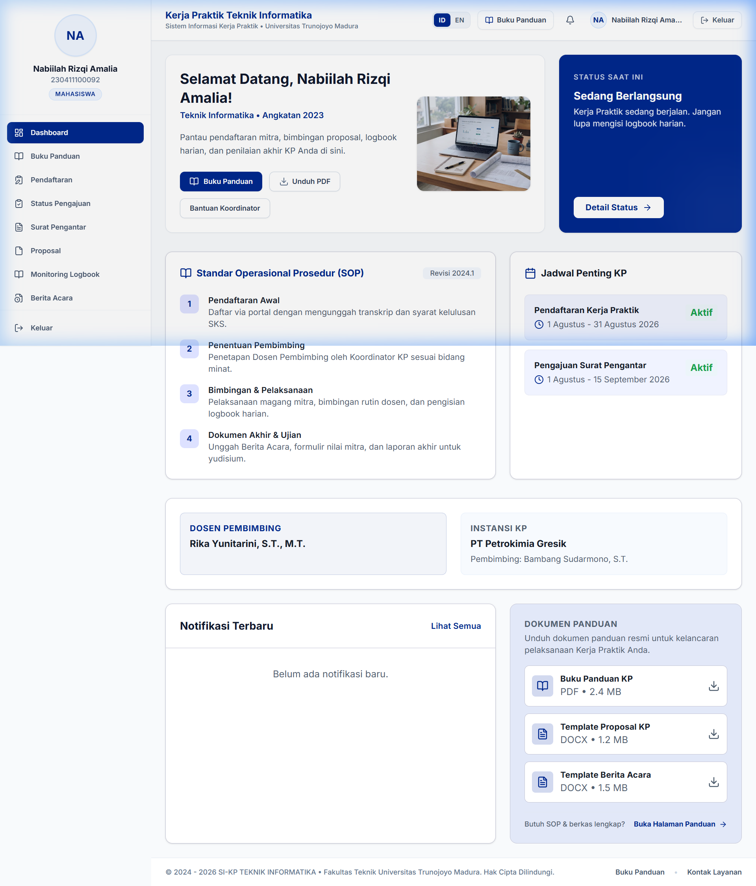
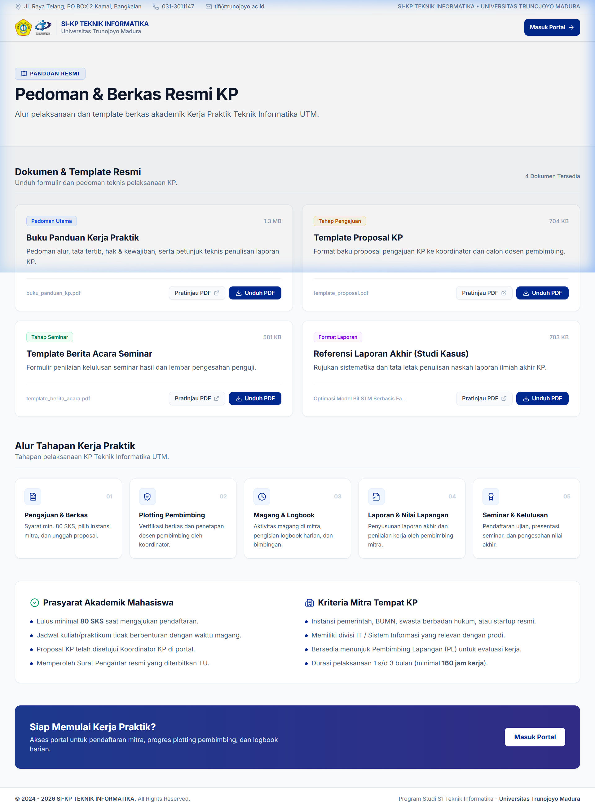
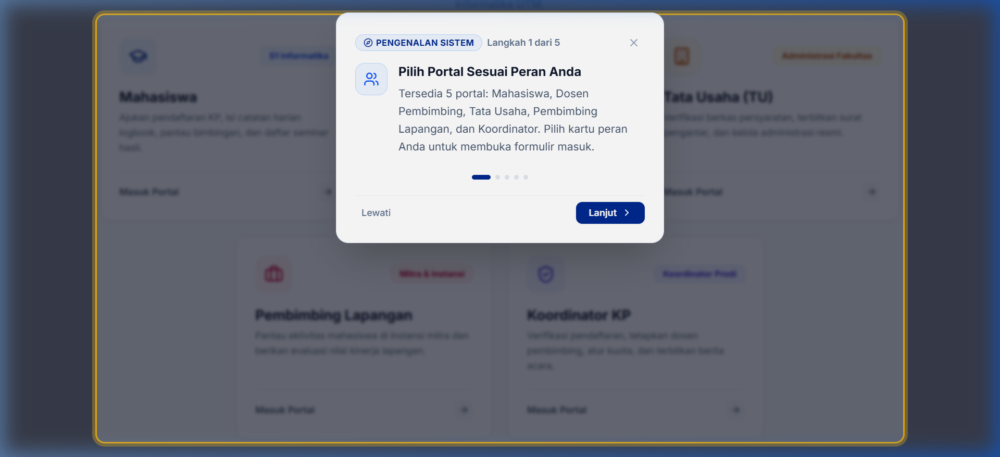
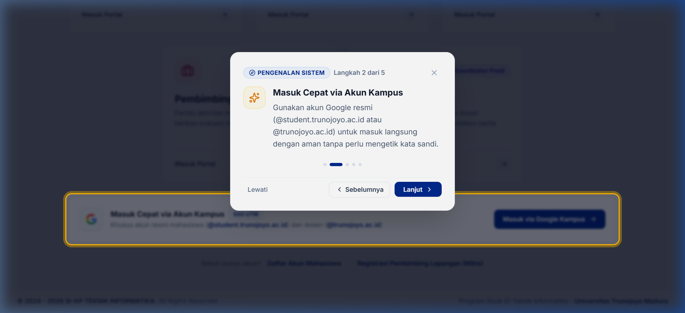

# SI-KP: Sistem Informasi Kerja Praktik

Aplikasi web manajemen Kerja Praktik (KP) untuk Program Studi S1 Teknik Informatika, Fakultas Teknik, Universitas Trunojoyo Madura (UTM). Sistem ini mengintegrasikan seluruh tahapan KP mulai dari pendaftaran mitra, verifikasi berkas oleh Tata Usaha, penetapan dosen pembimbing, pengisian logbook harian, hingga penilaian akhir dan penerbitan berita acara seminar.

---

## Tampilan Antarmuka Aplikasi

### 1. Dashboard Utama Mahasiswa
Pusat kontrol mahasiswa untuk memantau status pengajuan, alur Standar Operasional Prosedur (SOP), data dosen pembimbing, serta akses instan berkas panduan teknis.



### 2. Pedoman dan Berkas Resmi KP
Halaman khusus panduan resmi yang dilengkapi fitur pratinjau dokumen langsung di dalam aplikasi (PDF Viewer Modal), pengunduhan template proposal, format berita acara, dan referensi laporan akhir.



### 3. Portal Masuk Multi-Peran dan Tur Interaktif
Antarmuka login terpadu dengan 5 portal peran terpisah, dilengkapi panduan pengenalan antarmuka interaktif yang otomatis muncul saat pertama kali pengguna membuka peramban.



### 4. Single Sign-On (SSO) Google Kampus
Dukungan login instan menggunakan akun Google resmi UTM (@student.trunojoyo.ac.id dan @trunojoyo.ac.id) dengan keamanan berbasis OAuth 2.0.



---

## Keunggulan Utama Sistem

1. **Autentikasi Akun Kampus (Google SSO UTM)**  
   Mahasiswa dan dosen dapat langsung masuk menggunakan akun Google resmi institusi tanpa perlu mengetik kata sandi manual. Sistem memverifikasi domain kampus secara otomatis.

2. **5 Portal Peran Terintegrasi**  
   - **Mahasiswa**: Pendaftaran KP, unggah proposal, pengisian logbook aktivitas harian, pengajuan surat pengantar, dan cek nilai akhir.
   - **Dosen Pembimbing**: Tinjau proposal, validasi catatan logbook mingguan, pemberian catatan bimbingan, dan penginputan nilai akhir bimbingan.
   - **Tata Usaha (TU)**: Verifikasi kelengkapan berkas akademik (KRS dan transkrip), penerbitan nomor surat pengantar resmi, dan validasi berkas berita acara.
   - **Koordinator Program Studi**: Manajemen kuota bimbingan dosen, penentuan plotting pembimbing berdasarkan bidang minat, serta pembukaan periode KP.
   - **Pembimbing Lapangan (Mitra Instansi)**: Konfirmasi penerimaan mahasiswa, verifikasi kehadiran magang, dan evaluasi performa kerja industri.

3. **Tur Pengenalan Interaktif (Interactive Onboarding Tour)**  
   Sistem membaca status cookie dan session peramban pengguna. Jika terdeteksi sebagai kunjungan pertama, sistem menghadirkan popover tur interaktif dengan efek sorotan bertahap untuk menjelaskan fungsi tiap elemen. Pengguna juga dapat memanggil kembali panduan ini kapan saja melalui tombol navigasi.

4. **Pusat Panduan dan SOP Terpadu**  
   Dokumen resmi tidak hanya disajikan dalam bentuk tautan unduh, tetapi dapat dibaca langsung melalui modal penampil PDF di peramban. Seluruh dashboard peran memiliki akses cepat menuju halaman panduan.

5. **Dukungan Dua Bahasa (Bilingual ID / EN)**  
   Aplikasi mendukung Bahasa Indonesia sebagai bahasa baku utama dan Bahasa Inggris. Pengguna dapat berganti bahasa seketika dengan penyimpanan preferensi di session dan cookie jangka panjang.

6. **Aksesibilitas Teks Penuh**  
   Tidak ada restriksi pemblokiran teks pada antarmuka formulir. Pengguna bebas menyeleksi, menyalin nomor surat, NIP, NIM, atau teks panduan untuk kebutuhan administrasi.

---

## Teknologi yang Digunakan

- **Kerangka Kerja Backend**: Laravel 12 (PHP 8.2+)
- **Kerangka Kerja Frontend**: React 19, TypeScript
- **Penghubung Antarmuka**: Inertia.js v2
- **Desain dan Penataan**: Tailwind CSS v4
- **Perangkat Pembangun Aset**: Vite 6
- **Basis Data**: MySQL / MariaDB
- **Ikon Antarmuka**: Lucide React

---

## Panduan Instalasi dan Menjalankan Proyek

### 1. Kebutuhan Sistem
- PHP >= 8.2 dengan ekstensi pdo_mysql, mbstring, curl, gd, zip
- Composer >= 2.x
- Node.js >= 18.x dan NPM
- Server MySQL / MariaDB

### 2. Kloning Repositori
```bash
git clone https://github.com/ZekkCode/SI-KP.git
cd SI-KP
```

### 3. Pasang Dependensi Backend dan Frontend
```bash
composer install
npm install
```

### 4. Konfigurasi Environment
Salin file template `.env.example` menjadi `.env`:
```bash
cp .env.example .env
```

Buka file `.env` lalu sesuaikan konfigurasi basis data Anda:
```env
DB_CONNECTION=mysql
DB_HOST=127.0.0.1
DB_PORT=3306
DB_DATABASE=si-kp
DB_USERNAME=root
DB_PASSWORD=
```

Jika Anda ingin mengaktifkan Google SSO, isi kredensial OAuth dari Google Cloud Console:
```env
GOOGLE_CLIENT_ID=isi_client_id_anda
GOOGLE_CLIENT_SECRET=isi_client_secret_anda
GOOGLE_REDIRECT_URI=http://127.0.0.1:8000/auth/google/callback
```

### 5. Generate Application Key dan Migrasi Database
```bash
php artisan key:generate
php artisan migrate --seed
```

Perintah `migrate --seed` akan otomatis menyiapkan tabel dan membuat akun demo untuk semua peran.

### 6. Kompilasi Aset Frontend dan Jalankan Server
Buka dua jendela terminal terpisah:

**Terminal 1 (Vite Dev Server):**
```bash
npm run dev
```

**Terminal 2 (Laravel Backend Server):**
```bash
php artisan serve
```

Aplikasi kini dapat diakses melalui peramban di alamat: `http://localhost:8000`

---

## Akun Demo Bawaan untuk Pengujian

Semua akun demo di bawah ini menggunakan kata sandi default: `password`

| Peran | Pengenal / Email Masuk | Deskripsi Hak Akses |
|---|---|---|
| **Mahasiswa** | `230411100092` atau `230411100092@student.trunojoyo.ac.id` | Status KP aktif di PT Petrokimia Gresik, logbook terisi |
| **Dosen Pembimbing** | `rika@dosen.com` atau NIP `198002022001` | Dosen pembimbing dengan kuota aktif dan pengujian review proposal |
| **Tata Usaha (TU)** | `tu@admin.com` atau NIP `198501012010` | Verifikasi pendaftaran, persetujuan akun, pembuatan surat pengantar |
| **Koordinator Prodi** | `prodi@admin.com` atau NIP `197001012000` | Plotting dosen pembimbing, manajemen kuota, dan monitoring periode KP |
| **Pembimbing Lapangan** | `mitra@demo.com` | Evaluasi kerja praktik industri mahasiswa (PT Petrokimia Gresik) |

---

## Struktur Direktori Utama

```text
SI-KP/
├── app/
│   ├── Http/
│   │   ├── Controllers/       # Kontroler per peran (Mahasiswa, Dosen, TU, Prodi, Instansi, Auth)
│   │   └── Middleware/        # HandleInertiaRequests, manajemen bahasa, dan session
│   └── Models/                # Model Eloquent (User, Pendaftaran, Logbook, Instansi, dll.)
├── config/                    # Konfigurasi aplikasi, basis data, dan layanan pihak ketiga
├── database/
│   ├── migrations/            # Skema tabel basis data
│   └── seeders/               # Data awal akun demo, program studi, dan berkas simulasi
├── docs/
│   └── screenshots/           # Tangkapan layar antarmuka resmi sistem
├── lang/
│   ├── en/                    # Kamus terjemahan Bahasa Inggris
│   └── id/                    # Kamus terjemahan Bahasa Indonesia
├── public/
│   ├── dokumen/               # Berkas resmi (Buku panduan PDF, template proposal, template berita acara)
│   └── images/                # Logo resmi Teknik Informatika UTM dan ikon
├── resources/
│   ├── css/                   # Berkas stylesheet utama
│   ├── js/
│   │   ├── Components/        # Komponen UI (ModernTable, InterfaceTour, PdfViewerModal, LanguageSwitcher)
│   │   ├── Layouts/           # Tata letak tiap peran (MahasiswaLayout, DosenLayout, TULayout, ProdiLayout)
│   │   └── Pages/             # Halaman antarmuka Inertia React
│   └── views/                 # Template Blade induk (app.blade.php)
└── routes/
    ├── auth.php               # Rute autentikasi dan callback Google OAuth
    └── web.php                # Rute aplikasi per peran
```

---

## Lisensi

Proyek ini dilisensikan di bawah lisensi [MIT](LICENSE).
