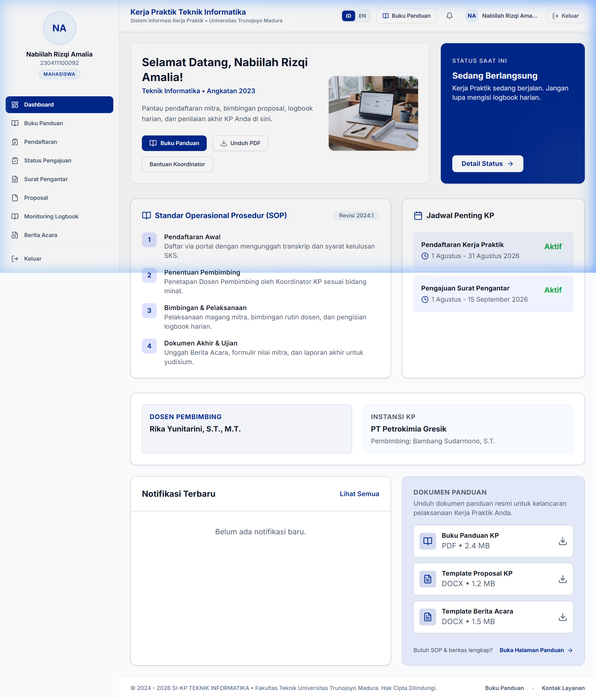
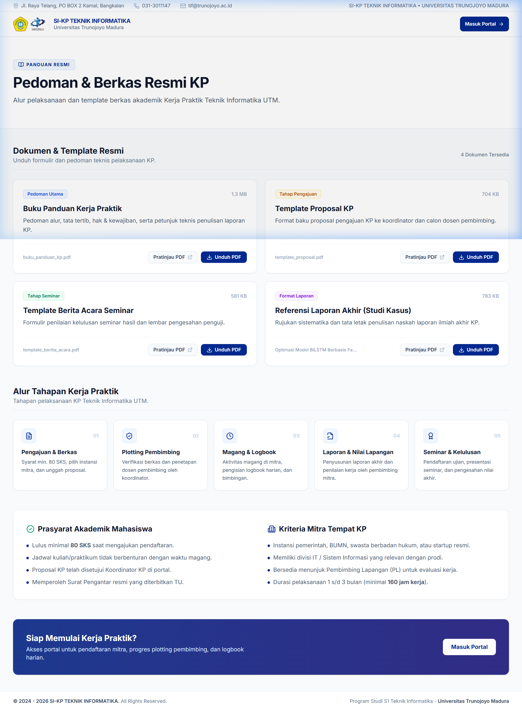
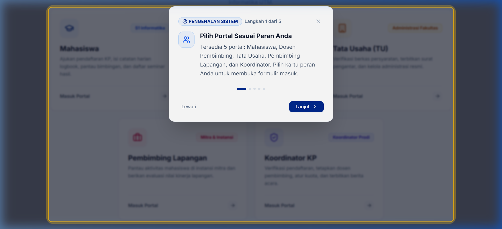
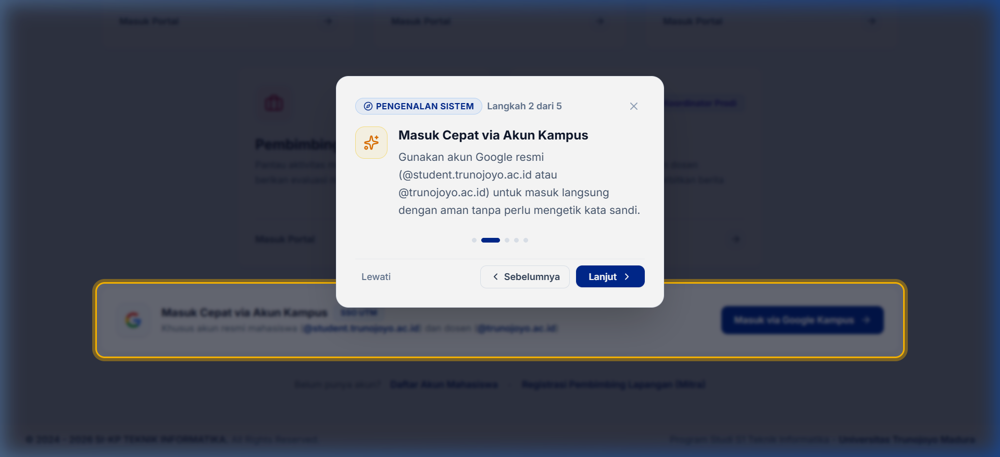

# SI-KP (Sistem Informasi Kerja Praktik)

Sistem informasi pengelolaan Kerja Praktik (KP) Program Studi Teknik Informatika, Fakultas Teknik, Universitas Trunojoyo Madura.

## Tech Stack

- **Backend:** Laravel 12/13, PHP 8.4+, OpenSpout
- **Frontend:** React 19, TypeScript, Inertia.js v2, Tailwind CSS v4
- **Database:** MySQL / MariaDB

---

## Instalasi

### 1. Prasyarat
- PHP >= 8.3 (rekomendasi PHP 8.4+)
- Ekstensi PHP: `pdo_mysql`, `zip`, `fileinfo`, `mbstring`, `gd`, `intl`
- Composer 2
- Node.js >= 18 & npm
- MySQL / MariaDB

### 2. Setup Proyek

```bash
# Clone repository
git clone https://github.com/ZekkCode/SI-KP.git
cd SI-KP

# Install dependensi
composer install
npm install

# Setup environment
cp .env.example .env
# Windows PowerShell: Copy-Item .env.example .env

# Generate application key
php artisan key:generate
```

Konfigurasi database di `.env`:
```env
DB_CONNECTION=mysql
DB_HOST=127.0.0.1
DB_PORT=3306
DB_DATABASE=si-kp
DB_USERNAME=root
DB_PASSWORD=
```

Buat database di MySQL:
```sql
CREATE DATABASE `si-kp`;
```

### 3. Migrasi, Seeder, dan Storage Link

```bash
# Migrasi tabel dan import master dosen & mahasiswa dari Excel
php artisan migrate --seed

# Buat symlink storage untuk akses file upload
php artisan storage:link
```

### 4. Menjalankan Aplikasi

Jalankan backend dan frontend:

```bash
# Terminal 1
php artisan serve

# Terminal 2
npm run dev
```

Atau jalankan bersamaan:
```bash
composer run dev
```

Buka `http://localhost:8000`.

---

## Akun Demo

Password demo: `password`

| Peran | Akun (NIM / NIP / Email) | Keterangan |
|---|---|---|
| **Mahasiswa** | `230411100092` | KP aktif di PT Petrokimia Gresik, logbook terisi |
| **Mahasiswa** | `230411100080` | Menunggu verifikasi berkas TU |
| **Dosen Pembimbing** | `198002022001` / `rika@dosen.com` | Review proposal, logbook, dan penilaian |
| **Tata Usaha (TU)** | `198501012010` / `tu@admin.com` | Verifikasi berkas dan surat pengantar |
| **Koordinator Prodi** | `197001012000` / `prodi@admin.com` | Plotting pembimbing dan kuota |
| **Pembimbing Lapangan** | `mitra@demo.com` | Pembimbing industri (PT Petrokimia Gresik) |

Form login menerima NIM, NIP, atau email.

---

## Troubleshooting

- **`Class "ZipArchive" not found`:** Aktifkan `extension=zip` di `php.ini`. OpenSpout membutuhkan ekstensi ini untuk membaca `master_dosen.xlsx` dan `master_mahasiswa.xlsx`.
- **Berkas unggahan 404:** Jalankan `php artisan storage:link`.
- **Unggah berkas gagal:** Naikkan `upload_max_filesize` dan `post_max_size` di `php.ini` (minimal `64M`).
- **Google SSO:** Isi `GOOGLE_CLIENT_ID` dan `GOOGLE_CLIENT_SECRET` di `.env` untuk mengaktifkan login Google.

---

## Tangkapan Layar

<p align="center">
  
  
</p>
<p align="center">
  
  
</p>

---

## Lisensi

[MIT](LICENSE)
